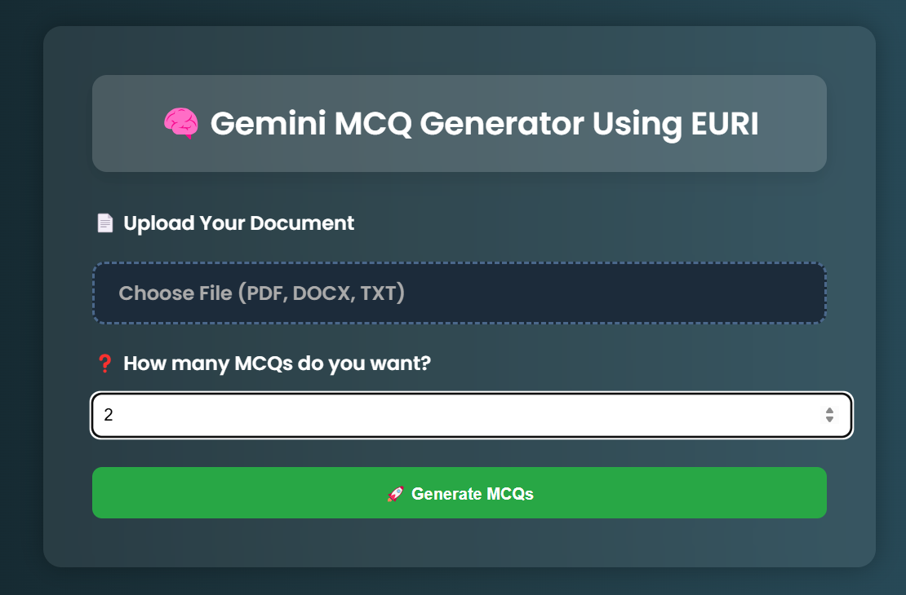
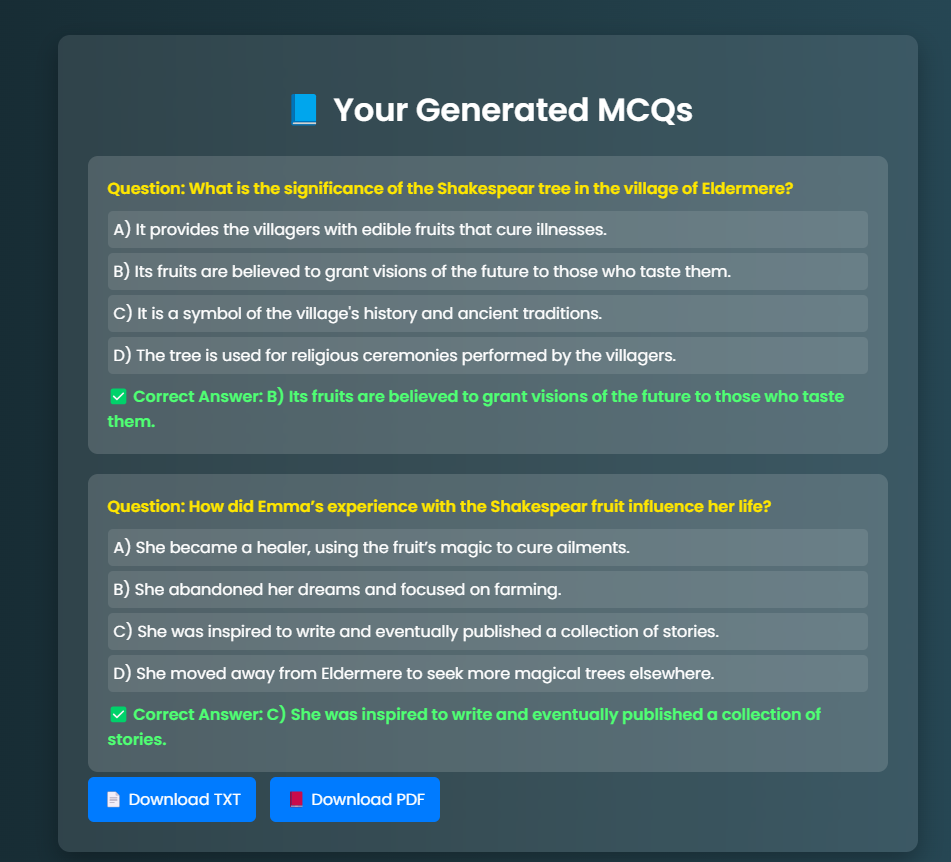

# 🧠 Gemini MCQ Generator Using EURI

Welcome to the **Gemini MCQ Generator**, a smart web app that uses **EURI** to generate multiple-choice questions (MCQs) from any uploaded document (PDF, DOCX, or TXT). It supports beautiful UI, PDF/TXT export, and logs all activity in an SQLite database.

---

## 🚀 Features

✨ **AI-powered MCQ Generation**  
📄 Supports **PDF**, **DOCX**, and **TXT** files  
🎯 Specify the number of MCQs to generate  
📥 Download results in **PDF** and **TXT** format  
🗂️ All input and output data is stored in **SQLite database**  
💻 Clean and responsive UI built with **Flask + HTML/CSS**  
🔗 **Social media footer** with official icons  
🎨 Stunning UI design with blur-glass effect and file picker enhancements  

---

## 📸 Demo




---

## 📁 Project Structure

```
MCQ-Generator/
│
├── app.py                     # Flask app
├── db.py                      # SQLite DB logic
├── database/
│   └── mcq.db                 # Database (auto-generated)
├── uploads/                   # Uploaded documents
├── results/                   # Generated MCQ TXT/PDF files
├── templates/
│   ├── index.html             # Upload UI
│   └── results.html           # MCQ results UI
├── static/
│   └── styles.css             # Custom styles (if separated)
└── README.md                  # You are here!

```

---

## 🛠️ Installation & Run Locally

### 1. Clone the repository

```bash
git clone https://github.com/MohammadWasiq0786/MCQs-Generator.git
cd MCQs-Generator
````

### 2. Create virtual environment

```bash
python -m venv venv
source venv/bin/activate  # On Windows: venv\Scripts\activate
```

### 3. Install dependencies

```bash
pip install -r requirements.txt
```

### 4. Set your **EURI API key**


Create & Open `.env` and write:

```bash
EURI_API_KEY = "EURI_API_KEY"
```

> Get your API key from: [https://euron.one/euri](https://euron.one/euri)

### 5. Run the app

```bash
python app.py
```

App will run at:
📍 `http://127.0.0.1:5000/`

---

## 🧠 How It Works

1. Upload a document (PDF, DOCX, or TXT)
2. Enter the number of questions to generate
3. Click “Generate MCQs”
4. The Gemini AI processes the text and returns formatted MCQs
5. Download the results in PDF or TXT format
6. Everything is logged to a local SQLite database

---

## 🧩 Dependencies

* `Flask`
* `fpdf`
* `pdfplumber`
* `python-docx`
* `euriai`
* `werkzeug`
* `python-dotenv`

> Install via: `pip install -r requirements.txt`

---

## 📦 Sample Output

```
## MCQ
Question: What is the capital of France?
A) Berlin
B) Madrid
C) Paris
D) Rome
Correct Answer: C) Paris
```

---

## 🧑‍💻 Author

👤 **Mohammad Wasiq**
💼 [LinkedIn](https://www.linkedin.com/in/mohammadwasiq0)
💻 [GitHub](https://github.com/MohammadWasiq0786)
📧 [your.email@example.com](mailto:mohammadwasiq0786@gmail.com)

---


## ⭐️ Show Your Support

If you found this project useful, consider giving it a ⭐ on GitHub.
Happy learning and building!
